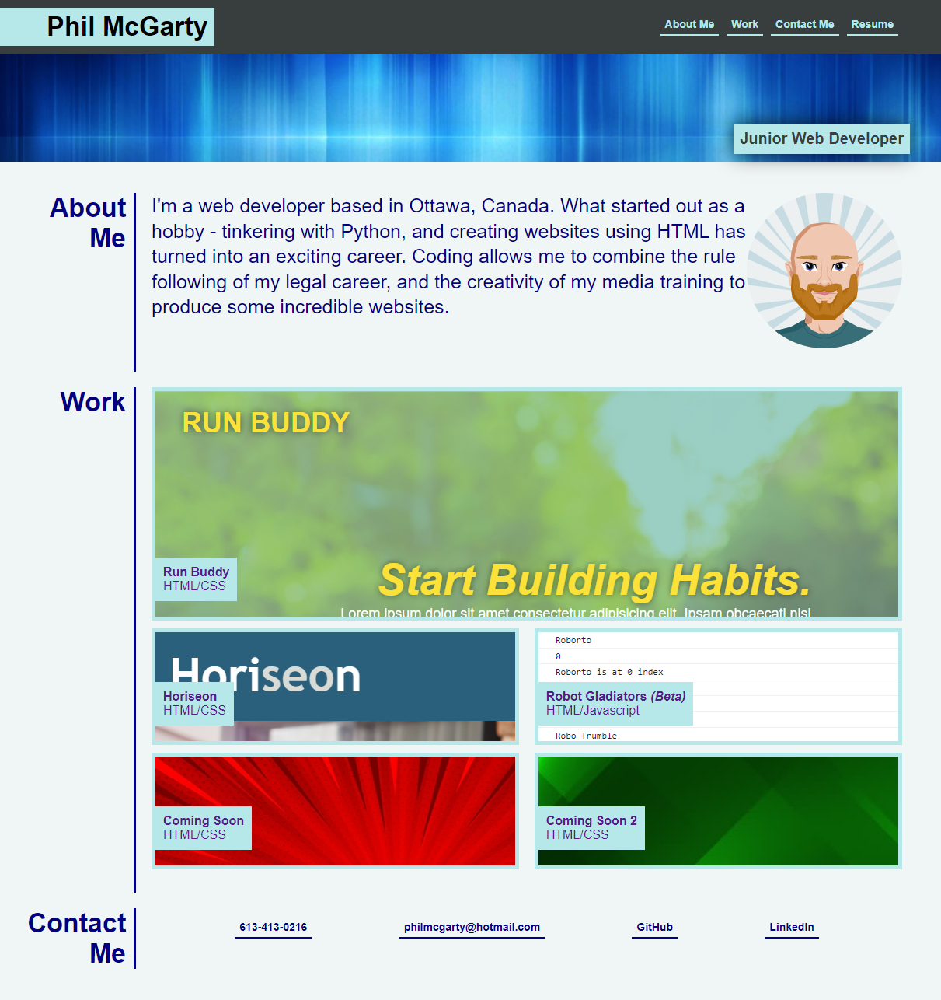
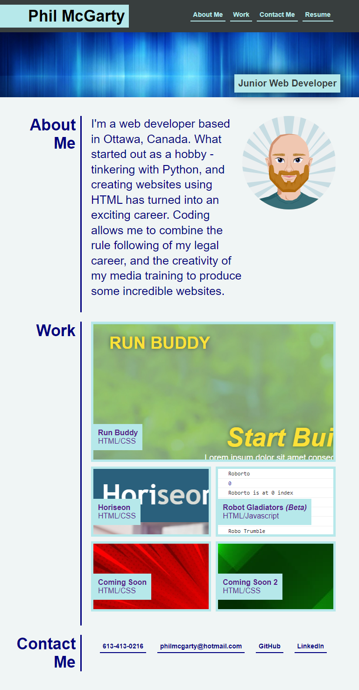
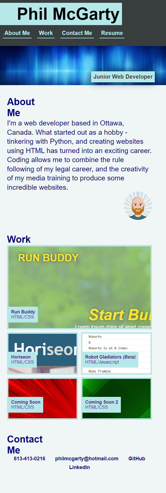

# Professional Portfolio

## About This Project

This is a one page website portfolio to showcase my work to potential employers.

This website was built from scratch, and utilizes HTML and CSS.

The Flexbox feature of CSS was used to configure the layout of the different areas of the page, and ensure the site can be viewed optimally on different screensizes. To accomodate some of the smaller elements, certain areas are flipped to column mode for smaller screens, and the objects made larger.

---
## How the Project Should Appear

Site as viewed on desktop

Site as viewed on smaller screen (tablet etc)

Site as viewed on small screen (phone etc)

---
## Links

[Project on Github](https://github.com/philmcgarty/portfolio "Github")

[Deployed Site](https://philmcgarty.github.io/portfolio/)